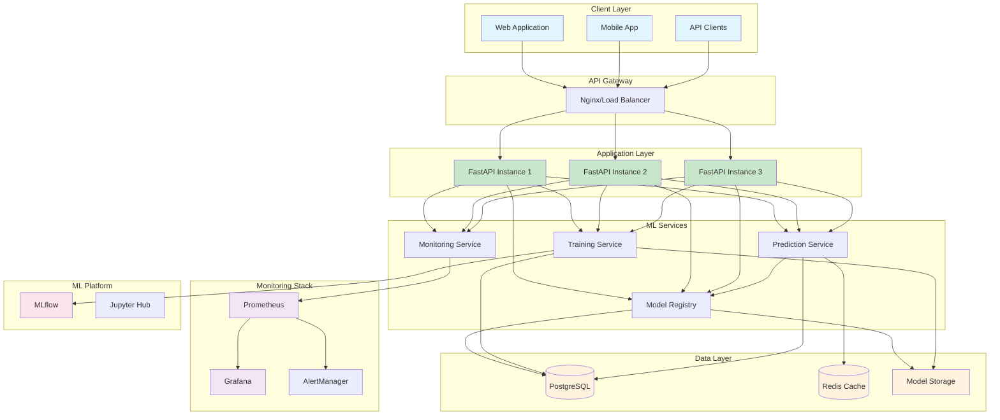
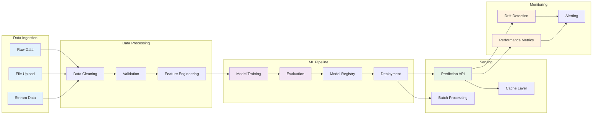
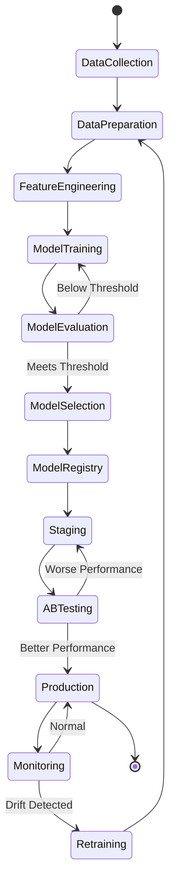
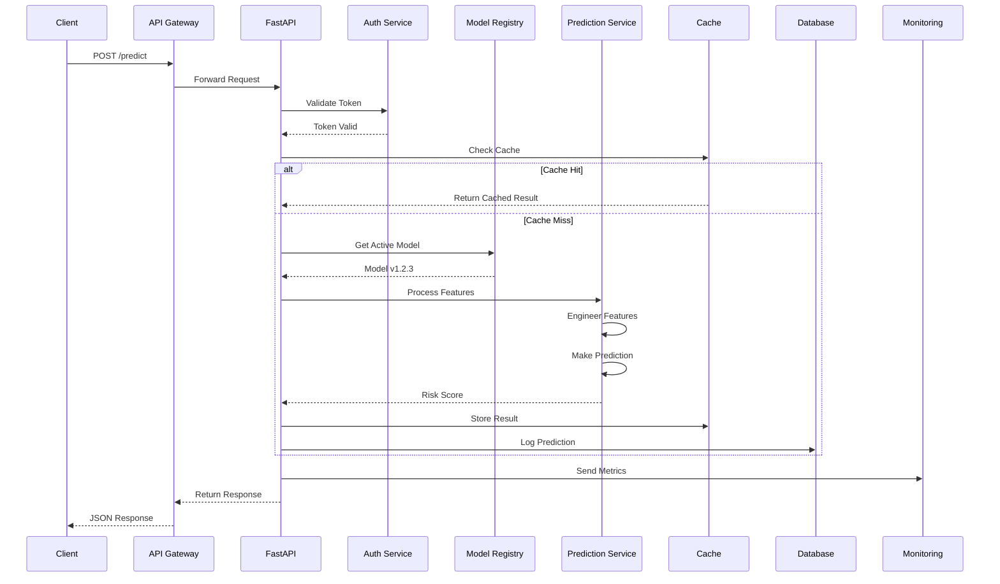

# Heart Attack Prediction System 🏥

A production-ready machine learning system for predicting heart attack risk using advanced ML models and modern MLOps practices.

## 🌟 Features

- **Multiple ML Models**: Random Forest, Gradient Boosting, XGBoost, and Ensemble methods
- **Real-time Predictions**: Fast API with sub-second response times
- **Model Versioning**: Complete model registry with version control
- **A/B Testing**: Compare model performances in production
- **Data Drift Detection**: Automatic monitoring for data distribution changes
- **Auto-scaling**: Kubernetes HPA for automatic scaling based on load
- **Comprehensive Monitoring**: Prometheus + Grafana dashboards
- **API Documentation**: Auto-generated OpenAPI/Swagger docs
- **Security**: JWT authentication, API keys, and rate limiting


## 🏗️ System Architecture

### High-Level Architecture



### Data Flow Architecture



### ML Model Lifecycle



### API Request Flow




## 🚀 Quick Start

### Local Development

```bash
# Clone the repository
git clone https://github.com/malak29/heart-attack-prediction.git
cd heart-attack-prediction

# Install dependencies
make install

# Run the application
make run

# Access the API
curl http://localhost:8000/api/v1/health
```

### Docker Deployment

```bash
# Build and run with Docker Compose
make docker-run

# Access services
# API: http://localhost:8000
# MLflow: http://localhost:5000
# Grafana: http://localhost:3000 (admin/admin)
```

### API Documentation

Once running, access the interactive API documentation:
- Swagger UI: http://localhost:8000/docs
- ReDoc: http://localhost:8000/redoc

## 📊 API Endpoints

### Prediction Endpoints
- `POST /api/v1/predict/` - Single patient prediction
- `POST /api/v1/predict/batch` - Batch predictions
- `POST /api/v1/predict/assess` - Detailed risk assessment

### Model Management
- `GET /api/v1/models/` - List all models
- `POST /api/v1/models/{version}/activate` - Activate model
- `POST /api/v1/models/compare` - Compare models

### Training
- `POST /api/v1/train/` - Train new model
- `POST /api/v1/train/upload-data` - Upload training data
- `GET /api/v1/train/jobs` - List training jobs

### Health & Monitoring
- `GET /api/v1/health/` - Basic health check
- `GET /api/v1/health/detailed` - Detailed system status
- `GET /api/v1/health/metrics` - Performance metrics

## 🏗️ Architecture

```
┌─────────────┐     ┌─────────────┐     ┌─────────────┐
│   FastAPI   │────▶│   ML Models │────▶│  Monitoring │
│     API     │     │   Registry  │     │  (Prometheus)│
└─────────────┘     └─────────────┘     └─────────────┘
       │                   │                    │
       ▼                   ▼                    ▼
┌─────────────┐     ┌─────────────┐     ┌─────────────┐
│  PostgreSQL │     │    Redis    │     │   Grafana   │
│   Database  │     │    Cache    │     │  Dashboard  │
└─────────────┘     └─────────────┘     └─────────────┘
```

## 🧪 Testing

```bash
# Run all tests
make test

# Run with coverage
pytest tests/ --cov=src --cov-report=html

# Run specific test file
pytest tests/test_api.py -v

# Run integration tests
make test-integration
```

## 📈 Model Training

### Using the API

```python
import requests

# Upload training data
with open('data.csv', 'rb') as f:
    response = requests.post(
        'http://localhost:8000/api/v1/train/upload-data',
        files={'file': f}
    )

# Train model
response = requests.post(
    'http://localhost:8000/api/v1/train/',
    json={
        'model_type': 'random_forest',
        'auto_tune': True,
        'validation_split': 0.2
    }
)
```

### Using CLI

```bash
# Train with default settings
make train

# Train with auto-tuning
make train-auto
```

## 🚢 Deployment

### Kubernetes

```bash
# Deploy to Kubernetes
kubectl apply -f kubernetes/deployment.yaml

# Check deployment status
kubectl get pods -n heart-attack-prediction

# Access logs
kubectl logs -f deployment/heart-attack-api -n heart-attack-prediction
```

### Docker Compose

```bash
# Start all services
docker-compose up -d

# View logs
docker-compose logs -f api

# Stop services
docker-compose down
```

## 📊 Monitoring

### Metrics Available
- Request count and latency
- Model prediction confidence
- Data drift indicators
- System resource usage
- Error rates

### Grafana Dashboards
1. Navigate to http://localhost:3000
2. Login with admin/admin
3. Import dashboards from `monitoring/grafana/dashboards/`

## 🔒 Security

### Authentication
- JWT tokens for user authentication
- API keys for service-to-service communication
- Rate limiting to prevent abuse

### Environment Variables
```bash
# Copy example env file
cp .env.example .env

# Update with your values
vim .env
```
